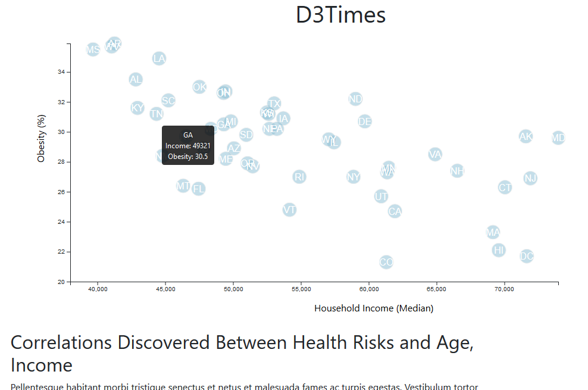

# D3 Data Journalism
UCF Data Analytics Bootcamp

Using D3 techniques to create a scatter plot that represents each state with circle elements and analyzing data based on information from the U.S. Census Bureau and the Behavioral Risk Factor Surveillance System.

* Note: You'll need to use `python -m http.server` to run the visualization. This will host the page at `localhost:8000` in your web browser. 
